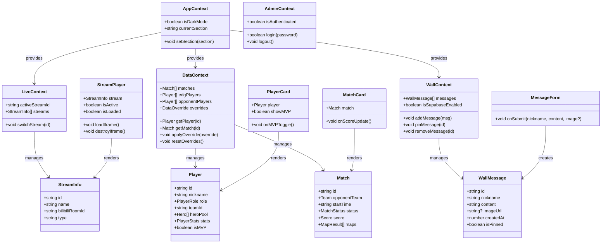
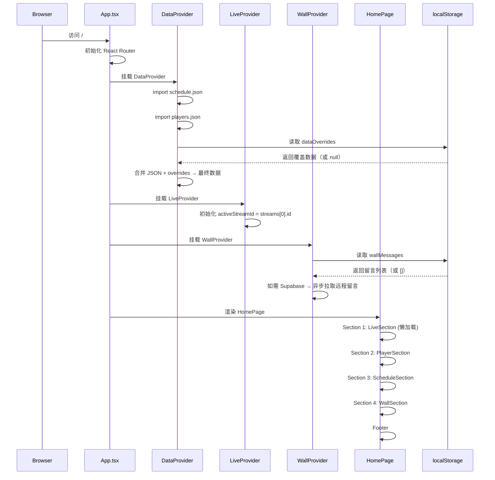
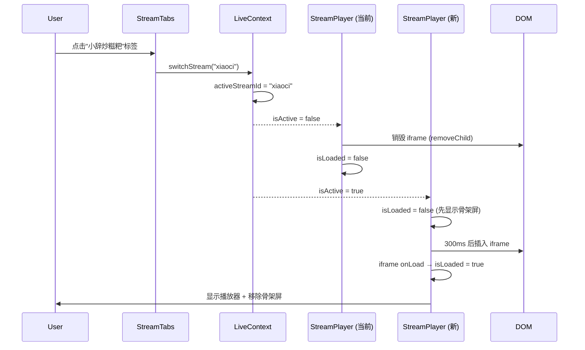
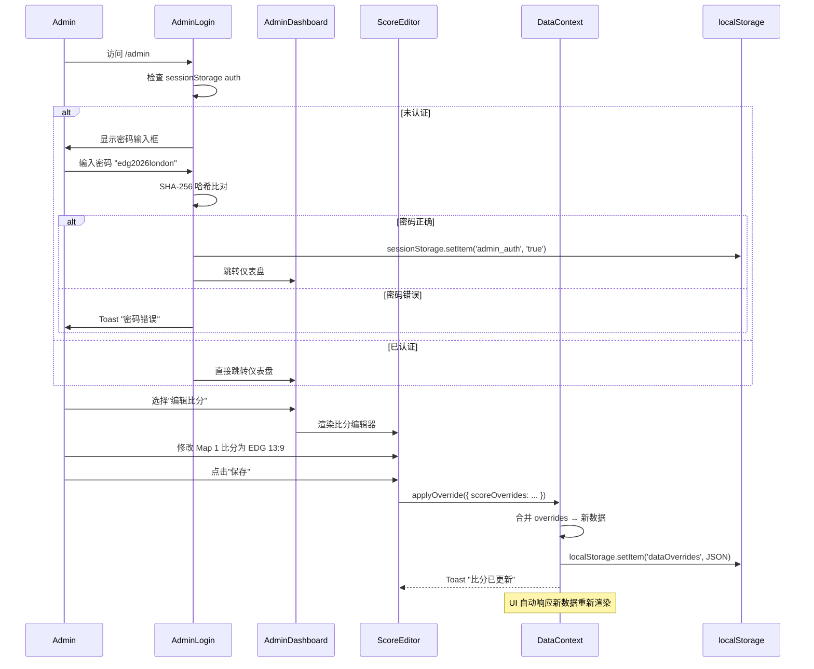
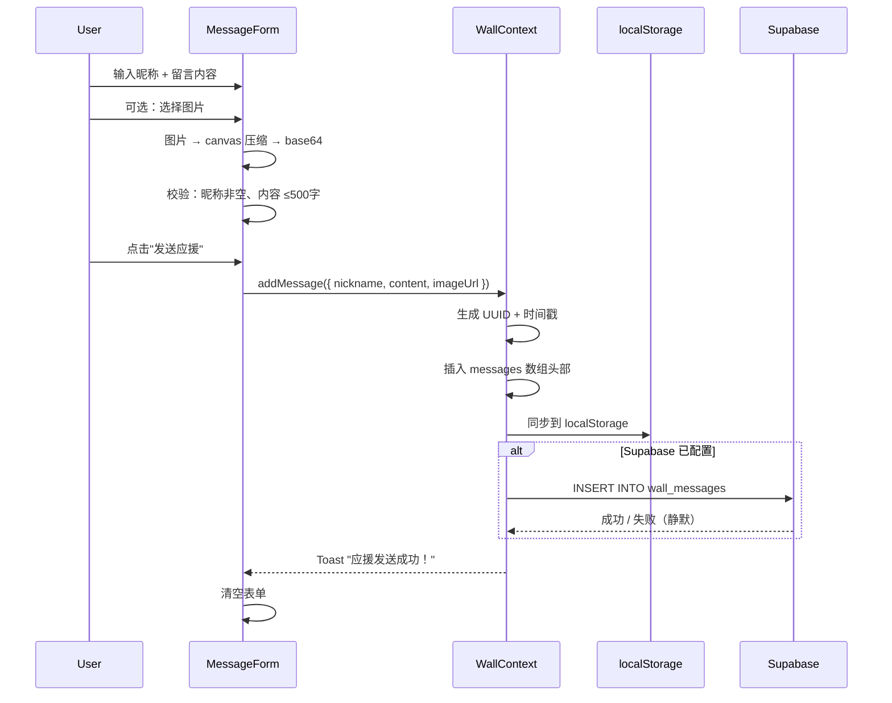
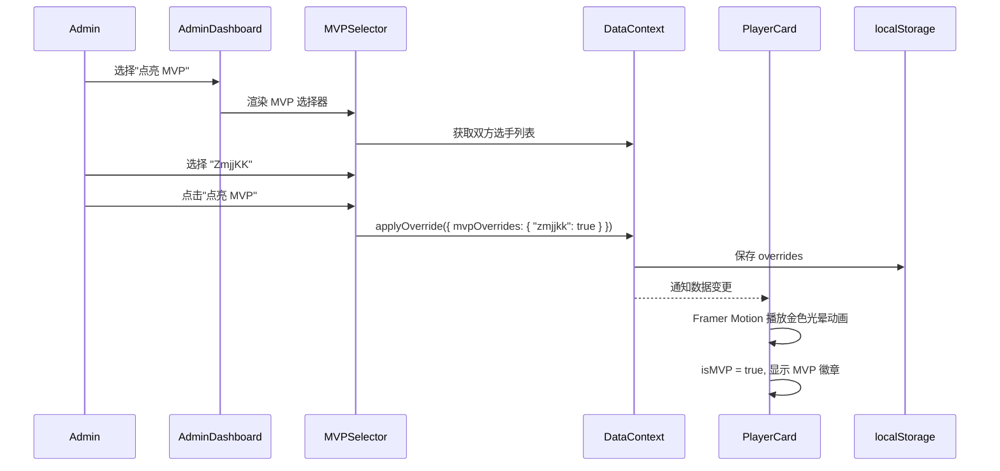
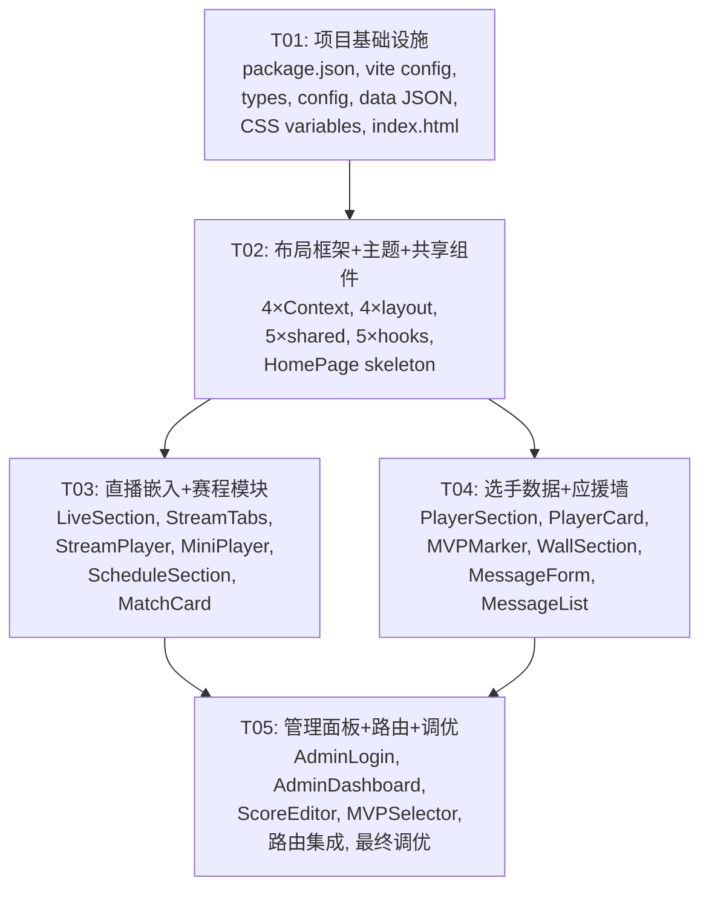

# EDG Valorant 伦敦大师赛粉丝应援网站 — 系统设计文档

> **项目代号**：edg-vct-london
> **版本**：v1.0
> **作者**：Bob（架构师）
> **日期**：2026-05-25

---

## Part A: 系统设计

### 1. 实现方案

#### 1.1 核心技术难点分析

| 难点 | 分析 | 解决方案 |
|------|------|---------|
| **B站直播 iframe 跨域与自动播放** | 浏览器禁止自动播放有声媒体；B站 iframe 有 CSP 限制 | 使用 `muted=1&autoplay=0` 参数，用户手动点击播放；iframe 懒加载 |
| **多直播间切换性能** | 三个直播间同时加载会消耗大量内存和带宽 | 仅当前激活标签页加载 iframe，切换时动态挂载/销毁 |
| **赛中数据实时更新（无后端）** | 无 API，无数据库，需支持赛中快速更新 | 管理面板修改 → Supabase 写入 → 所有用户从 Supabase 读取覆盖数据（WebSocket 可选，默认轮询 30 秒） |
| **应援墙数据持久化与多用户共享** | 纯前端站点，多人必须看到同一面墙 | **Supabase 免费层强制集成**（非可选），`localStorage` 仅作本地缓存兜底 |
| **移动端直播体验** | 小屏看直播 + 看数据，空间有限 | 直播区支持小窗模式（PiP 模拟），可折叠/展开 |
| **微信内置浏览器适配** | 微信浏览器对 CSS `100vh`、`position: fixed` 支持有差异 | 使用 `-webkit-fill-available` 降级；底部固定栏加安全区 padding |

#### 1.2 框架与库选型

| 类别 | 选择 | 版本 | 理由 |
|------|------|------|------|
| 构建工具 | Vite | ^6.x | 极速 HMR，天然支持 TS/JSX，EdgeOne Pages 原生支持 |
| UI 框架 | React | ^19.x | 生态成熟，社区资源丰富 |
| 语言 | TypeScript | ^5.8.x | 类型安全，数据模型校验 |
| CSS 方案 | Tailwind CSS | ^4.x | 原子化 CSS，移动端优先，暗色模式原生支持 |
| 动画库 | Framer Motion | ^12.x | 声明式动画 API，轻量级 |
| 图标库 | Lucide React | ^0.500.x | 图标丰富，tree-shakable，体积小 |
| 路由 | React Router DOM | ^7.x | SPA 路由标准方案 |
| 状态管理 | React Context + useReducer | 内置 | 无需额外依赖，满足需求 |
| BaaS | Supabase | @supabase/supabase-js ^2.x | 免费层数据库 + 实时订阅，承载应援墙和数据覆盖 |
| 部署 | EdgeOne Pages | — | 已连接，免费 |

#### 1.3 架构模式

采用 **单页面应用（SPA）+ 组件化架构**，三层结构：

```
┌─────────────────────────────────────────┐
│              UI 层（Pages + Components）   │
│   HomePage  AdminPage  SharedComponents  │
├─────────────────────────────────────────┤
│           状态层（Context + Reducer）       │
│   AppContext  LiveContext  DataContext   │
│   AdminContext  WallContext              │
├─────────────────────────────────────────┤
│           数据层（JSON + Supabase）        │
│   schedule.json  players.json            │
│   results.json   Supabase (wall + override)│
└─────────────────────────────────────────┘
```

---

### 2. 文件列表

```
edg-vct-london/
├── index.html                          # 入口 HTML，含微信 meta 标签
├── package.json                        # 依赖与脚本
├── tsconfig.json                       # TypeScript 配置
├── tsconfig.node.json                  # Node 端 TS 配置
├── vite.config.ts                      # Vite 构建配置
├── tailwind.config.ts                  # Tailwind 主题扩展（EDG 色彩）
├── postcss.config.js                   # PostCSS 配置
├── public/
│   ├── favicon.svg                     # EDG 标志 favicon
│   ├── qr-wechat-group.png             # 微信群二维码图片
│   └── og-image.png                    # Open Graph 分享图
├── data/
│   ├── schedule.json                   # EDG 赛程数据
│   ├── players.json                    # 选手静态数据（EDG + 对手）
│   ├── results.json                    # 赛后结果/KDA 数据
│   └── hero-pool.json                  # 英雄池数据（英雄名→头像映射）
├── src/
│   ├── main.tsx                        # 应用入口
│   ├── App.tsx                         # 根组件（路由 + Provider）
│   ├── index.css                       # 全局样式 + CSS 变量 + Tailwind 指令
│   ├── vite-env.d.ts                   # Vite 类型声明
│   │
│   ├── types/
│   │   ├── index.ts                    # 统一导出
│   │   ├── player.ts                   # Player, Team, PlayerStats 类型
│   │   ├── schedule.ts                 # Match, Schedule 类型
│   │   ├── stream.ts                   # StreamInfo 类型
│   │   ├── wall.ts                     # WallMessage 类型
│   │   └── admin.ts                    # AdminState, AdminAction 类型
│   │
│   ├── config/
│   │   ├── index.ts                    # 统一导出
│   │   ├── streams.ts                  # 直播间配置
│   │   ├── theme.ts                    # 主题色彩常量
│   │   ├── constants.ts               # 全局常量（站点名、日期等）
│   │   └── supabase.ts                # Supabase 客户端初始化
│   │
│   ├── context/
│   │   ├── AppContext.tsx              # 全局应用状态（深色模式、当前页面）
│   │   ├── LiveContext.tsx             # 直播状态（当前激活直播间）
│   │   ├── DataContext.tsx             # 比赛数据状态（赛程/选手/结果，含管理面板覆盖）
│   │   └── WallContext.tsx             # 应援墙状态（留言列表）
│   │
│   ├── hooks/
│   │   ├── useMediaQuery.ts            # 响应式断点检测
│   │   ├── useLocalStorage.ts          # localStorage 读写封装
│   │   ├── useWallMessages.ts          # 应援墙留言 CRUD
│   │   ├── useAdminAuth.ts             # 管理面板认证
│   │   └── useIframeLoader.ts          # iframe 懒加载控制
│   │
│   ├── components/
│   │   ├── layout/
│   │   │   ├── Header.tsx              # 顶部导航栏（EDG Logo + 锚点菜单）
│   │   │   ├── Footer.tsx              # 底部（微信群二维码 + 分享按钮）
│   │   │   ├── Container.tsx           # 内容容器（max-width + padding）
│   │   │   └── Section.tsx             # 通用区块包装器（标题 + 内容）
│   │   │
│   │   ├── live/
│   │   │   ├── LiveSection.tsx         # 直播区容器
│   │   │   ├── StreamTabs.tsx          # 直播间标签页切换
│   │   │   ├── StreamPlayer.tsx        # B站 iframe 播放器（懒加载）
│   │   │   └── MiniPlayer.tsx          # 移动端小窗播放器
│   │   │
│   │   ├── players/
│   │   │   ├── PlayerSection.tsx       # 选手数据区容器
│   │   │   ├── PlayerCard.tsx          # 单个选手数据卡片
│   │   │   ├── PlayerCardGrid.tsx      # 选手卡片网格布局
│   │   │   ├── MVPMarker.tsx           # MVP 标记动画组件
│   │   │   └── HeroPoolDisplay.tsx     # 英雄池展示
│   │   │
│   │   ├── schedule/
│   │   │   ├── ScheduleSection.tsx     # 赛程区容器
│   │   │   ├── MatchCard.tsx           # 单场比赛卡片
│   │   │   └── CountdownTimer.tsx      # 倒计时组件
│   │   │
│   │   ├── wall/
│   │   │   ├── WallSection.tsx         # 应援墙容器
│   │   │   ├── MessageForm.tsx         # 留言输入表单
│   │   │   ├── MessageCard.tsx         # 单条留言卡片
│   │   │   └── MessageList.tsx         # 留言列表（虚拟滚动）
│   │   │
│   │   ├── admin/
│   │   │   ├── AdminLogin.tsx          # 管理面板登录
│   │   │   ├── AdminDashboard.tsx      # 管理面板仪表盘
│   │   │   ├── ScoreEditor.tsx         # 地图比分编辑
│   │   │   ├── MVPSelector.tsx         # MVP 选手选择
│   │   │   └── DataSyncPanel.tsx       # 数据同步面板
│   │   │
│   │   └── shared/
│   │       ├── Skeleton.tsx            # 骨架屏组件
│   │       ├── ErrorBoundary.tsx       # 错误边界
│   │       ├── Toast.tsx               # 提示消息
│   │       ├── Modal.tsx               # 模态框
│   │       ├── LoadingSpinner.tsx      # 加载动画
│   │       └── ShareButton.tsx         # 分享按钮（Web Share API）
│   │
│   └── pages/
│       ├── HomePage.tsx                # 首页（所有区块的纵向组合）
│       └── AdminPage.tsx               # 管理面板页
```

---

### 3. 数据结构与接口

#### 3.1 TypeScript 类型定义

```typescript
// ============ src/types/player.ts ============

/** 选手位置 */
export type PlayerRole = 'Duelist' | 'Initiator' | 'Controller' | 'Sentinel' | 'Flex';

/** 队伍信息 */
export interface Team {
  id: string;           // "edg" | "opponent"
  name: string;         // "EDward Gaming" | 对手队名
  shortName: string;    // "EDG"
  logo: string;         // Logo 图片路径
  color: string;        // 队伍主色 hex
}

/** 英雄信息 */
export interface Hero {
  name: string;         // "Jett"
  icon: string;         // 英雄头像路径
  role: string;         // "Duelist"
}

/** 选手统计 */
export interface PlayerStats {
  acs: number;          // Average Combat Score
  kd: number;           // Kill/Death ratio
  kills: number;        // 总击杀
  deaths: number;       // 总死亡
  assists: number;      // 总助攻
  hsPercent: number;    // 爆头率 (%)
  fkpr: number;         // First Kills Per Round
}

/** 选手 */
export interface Player {
  id: string;           // 唯一 ID
  nickname: string;     // 游戏昵称 "ZmjjKK"
  realName: string;     // 真实姓名
  role: PlayerRole;
  teamId: string;       // 所属队伍 ID
  avatar: string;       // 头像图片路径
  heroPool: Hero[];     // 常用英雄池（最多5个）
  stats: PlayerStats;   // 当前数据
  isMVP: boolean;       // 是否已点亮 MVP
}
```

```typescript
// ============ src/types/schedule.ts ============

/** 比分 */
export interface Score {
  edg: number;
  opponent: number;
}

/** 地图结果 */
export interface MapResult {
  mapName: string;      // "Bind" | "Haven" | "Ascent" | ...
  edgScore: number;
  opponentScore: number;
  winner: 'edg' | 'opponent' | null;  // null = 未开始
  status: 'upcoming' | 'live' | 'finished';
  vodLink?: string;     // 赛后回放链接
}

/** 比赛状态 */
export type MatchStatus = 'upcoming' | 'live' | 'finished';

/** 比赛 */
export interface Match {
  id: string;
  edgTeam: Team;
  opponentTeam: Team;
  stage: string;        // "淘汰赛" | "胜者组半决赛" | "败者组决赛" | "总决赛"
  startTime: string;    // ISO 8601 格式 "2026-06-12T16:00:00Z"
  status: MatchStatus;
  score: Score;         // 大比分
  maps: MapResult[];    // 各图比分
  format: string;       // "BO3" | "BO5"
  casters?: string[];   // 解说阵容
}
```

```typescript
// ============ src/types/stream.ts ============

/** 直播间信息 */
export interface StreamInfo {
  id: string;
  name: string;           // 主播/频道名称
  bilibiliRoomId: string; // B站房间号
  platform: 'bilibili';
  type: 'official' | 'caster';  // 官方流 / 二路解说
  description: string;    // 简短描述
  avatar?: string;        // 主播头像
}
```

```typescript
// ============ src/types/wall.ts ============

/** 应援墙留言 */
export interface WallMessage {
  id: string;             // UUID
  nickname: string;       // 粉丝昵称
  content: string;        // 留言内容（纯文本，最多500字）
  imageUrl?: string;      // 可选图片（base64 或 Supabase URL）
  createdAt: number;      // 时间戳
  isPinned: boolean;      // 是否置顶（管理员权限）
}
```

```typescript
// ============ src/types/admin.ts ============

/** 管理面板状态 */
export interface AdminState {
  isAuthenticated: boolean;
  adminPassword: string;  // hash
}

/** 数据更新操作 */
export interface DataOverride {
  /** 覆盖的选手 MVP 状态 (playerId → isMVP) */
  mvpOverrides: Record<string, boolean>;
  /** 覆盖的比赛比分 (matchId → { score, maps }) */
  scoreOverrides: Record<string, { score: Score; maps: MapResult[] }>;
  /** 覆盖的比赛状态 (matchId → MatchStatus) */
  statusOverrides: Record<string, MatchStatus>;
}
```

#### 3.2 JSON 数据文件结构

```typescript
// data/schedule.json
{
  "matches": [
    {
      "id": "match-1",
      "stage": "胜者组半决赛",
      "startTime": "2026-06-12T16:00:00Z",
      "format": "BO3",
      "opponent": {
        "id": "tbd-1",
        "name": "TBD",
        "shortName": "TBD",
        "logo": "/logos/default.png",
        "color": "#888888"
      },
      "maps": [
        { "mapName": "TBD", "edgScore": 0, "opponentScore": 0, "winner": null, "status": "upcoming" },
        { "mapName": "TBD", "edgScore": 0, "opponentScore": 0, "winner": null, "status": "upcoming" },
        { "mapName": "TBD", "edgScore": 0, "opponentScore": 0, "winner": null, "status": "upcoming" }
      ],
      "casters": []
    }
  ]
}
```

```typescript
// data/players.json
{
  "edg": [
    {
      "id": "zmjjkk",
      "nickname": "ZmjjKK",
      "realName": "郑永康",
      "role": "Duelist",
      "teamId": "edg",
      "avatar": "/players/zmjjkk.png",
      "heroPool": [
        { "name": "Jett", "icon": "/heroes/jett.png", "role": "Duelist" },
        { "name": "Neon", "icon": "/heroes/neon.png", "role": "Duelist" },
        { "name": "Raze", "icon": "/heroes/raze.png", "role": "Duelist" }
      ],
      "stats": { "acs": 0, "kd": 0, "kills": 0, "deaths": 0, "assists": 0, "hsPercent": 0, "fkpr": 0 },
      "isMVP": false
    }
    // ... 其余4名 EDG 选手同理
  ],
  "opponent": [
    // 对手5名选手（赛前补充，初始 stats 全为 0）
  ]
}
```

#### 3.3 类图（Mermaid）



---

### 4. 程序调用流程（Mermaid 序列图）

#### 4.1 首页加载流程



#### 4.2 直播间切换流程



#### 4.3 管理面板更新比分流程



#### 4.4 应援墙留言提交流程



#### 4.5 MVP 点亮流程



---

### 5. 任何不明确之处

| # | 不明确点 | 假设/决策 |
|---|---------|----------|
| 1 | 对手选手数据何时可用 | 假设赛前 24 小时可从 vlr.gg 获取，需手动录入 `players.json` |
| 2 | Supabase 是否最终使用 | **已确定为强制方案**：应援墙留言 + 赛中数据覆盖均通过 Supabase 持久化。需注册免费项目并配置环境变量 |
| 3 | 管理面板密码 | 初始密码 `edg2026london`（SHA-256 hash），通过环境变量 `VITE_ADMIN_PASSWORD_HASH` 覆盖 |
| 4 | 微信群二维码更新 | 图片放 `public/qr-wechat-group.png`，群主可替换；如群满可快速更新图片 |
| 5 | B站直播间是否可能变动 | 三位主播的房间号写死在 `config/streams.ts`，如有变动需改代码重新部署 |
| 6 | 赛后 VOD 回放链接 | `results.json` 中预留 `vodLink` 字段，赛后手动补充 |
| 7 | 对手队名 TBD | 初始设为 "TBD"，赛程确定后更新 `schedule.json` |

---

## Part B: 任务分解

### 6. 必需依赖包

```json
{
  "dependencies": {
    "react": "^19.1.0",
    "react-dom": "^19.1.0",
    "react-router-dom": "^7.5.0",
    "framer-motion": "^12.9.0",
    "lucide-react": "^0.501.0",
    "@supabase/supabase-js": "^2.49.0"
  },
  "devDependencies": {
    "@types/react": "^19.1.0",
    "@types/react-dom": "^19.1.0",
    "@vitejs/plugin-react": "^4.4.0",
    "autoprefixer": "^10.4.20",
    "postcss": "^8.5.0",
    "tailwindcss": "^4.1.0",
    "typescript": "^5.8.0",
    "vite": "^6.3.0"
  }
}
```

### 7. 任务列表（按依赖顺序）

---

#### T01：项目基础设施

| 属性 | 内容 |
|------|------|
| **任务 ID** | T01 |
| **任务名称** | 项目基础设施搭建 |
| **源文件** | `package.json`, `vite.config.ts`, `tsconfig.json`, `tsconfig.node.json`, `tailwind.config.ts`, `postcss.config.js`, `index.html`, `src/main.tsx`, `src/App.tsx`, `src/index.css`, `src/vite-env.d.ts`, `src/types/index.ts`, `src/types/player.ts`, `src/types/schedule.ts`, `src/types/stream.ts`, `src/types/wall.ts`, `src/types/admin.ts`, `src/config/index.ts`, `src/config/streams.ts`, `src/config/theme.ts`, `src/config/constants.ts`, `data/schedule.json`, `data/players.json`, `data/results.json`, `data/hero-pool.json`, `public/favicon.svg`, `public/og-image.png` |
| **依赖** | 无 |
| **优先级** | P0 |

**详细说明**：

1. 初始化 Vite + React + TypeScript 项目
2. 配置 Tailwind CSS v4（`@import "tailwindcss"` 方式），扩展 EDG 主题色彩
3. 创建所有 TypeScript 类型定义文件
4. 创建 `data/` 目录下的 JSON 数据文件（含 EDG 5 名选手初始数据、赛程占位数据）
5. 配置 `index.html` 微信 meta 标签（`viewport`、`apple-mobile-web-app-capable`、Open Graph）
6. 编写 `src/index.css`：Tailwind 指令 + CSS 变量（EDG 色彩系统）+ 全局 reset
7. 编写 `src/main.tsx`（ReactDOM.createRoot）和 `src/App.tsx`（BrowserRouter + Context Providers 骨架）
8. 编写所有配置文件：直播间列表、主题常量、全局常量

**CSS 变量定义（在 `src/index.css` 中）**：

```css
@import "tailwindcss";

:root {
  /* EDG 品牌色 */
  --color-primary: #E10600;
  --color-primary-hover: #FF1A14;
  --color-primary-dark: #B30500;

  /* 深色背景系统 */
  --color-bg-primary: #0A0A0A;
  --color-bg-secondary: #141414;
  --color-bg-tertiary: #1E1E1E;
  --color-bg-card: #1A1A1A;
  --color-bg-elevated: #252525;

  /* 文字颜色 */
  --color-text-primary: #F5F5F5;
  --color-text-secondary: #A0A0A0;
  --color-text-tertiary: #666666;
  --color-text-inverse: #0A0A0A;

  /* 金色高光 */
  --color-gold: #D4A853;
  --color-gold-light: #F0D078;
  --color-gold-dark: #B8922E;

  /* 功能色 */
  --color-success: #22C55E;
  --color-warning: #F59E0B;
  --color-error: #EF4444;
  --color-info: #3B82F6;

  /* 边框 */
  --color-border: #2A2A2A;
  --color-border-light: #3A3A3A;

  /* 间距 */
  --spacing-section: 2rem;

  /* 圆角 */
  --radius-sm: 6px;
  --radius-md: 10px;
  --radius-lg: 16px;
  --radius-xl: 24px;
  --radius-full: 9999px;

  /* 阴影 */
  --shadow-card: 0 2px 8px rgba(0, 0, 0, 0.4);
  --shadow-elevated: 0 4px 16px rgba(0, 0, 0, 0.5);
  --shadow-glow-gold: 0 0 20px rgba(212, 168, 83, 0.3);

  /* 动画 */
  --transition-fast: 150ms ease;
  --transition-normal: 250ms ease;
  --transition-slow: 400ms ease;

  /* 字体 */
  --font-sans: 'Inter', 'PingFang SC', 'Microsoft YaHei', sans-serif;
  --font-mono: 'JetBrains Mono', 'Fira Code', monospace;
  --font-number: 'Inter', 'DIN', 'Helvetica Neue', sans-serif;
}
```

**Tailwind 主题扩展（`tailwind.config.ts`）**：

```typescript
import type { Config } from 'tailwindcss'

const config: Config = {
  content: ['./index.html', './src/**/*.{ts,tsx}'],
  theme: {
    extend: {
      colors: {
        primary: {
          DEFAULT: '#E10600',
          hover: '#FF1A14',
          dark: '#B30500',
        },
        bg: {
          primary: '#0A0A0A',
          secondary: '#141414',
          tertiary: '#1E1E1E',
          card: '#1A1A1A',
          elevated: '#252525',
        },
        text: {
          primary: '#F5F5F5',
          secondary: '#A0A0A0',
          tertiary: '#666666',
        },
        gold: {
          DEFAULT: '#D4A853',
          light: '#F0D078',
          dark: '#B8922E',
        },
        border: {
          DEFAULT: '#2A2A2A',
          light: '#3A3A3A',
        },
      },
      fontFamily: {
        sans: ['Inter', 'PingFang SC', 'Microsoft YaHei', 'sans-serif'],
        mono: ['JetBrains Mono', 'Fira Code', 'monospace'],
        number: ['Inter', 'DIN', 'Helvetica Neue', 'sans-serif'],
      },
      borderRadius: {
        sm: '6px',
        md: '10px',
        lg: '16px',
        xl: '24px',
      },
      boxShadow: {
        card: '0 2px 8px rgba(0, 0, 0, 0.4)',
        elevated: '0 4px 16px rgba(0, 0, 0, 0.5)',
        'glow-gold': '0 0 20px rgba(212, 168, 83, 0.3)',
      },
    },
  },
  plugins: [],
}
export default config
```

**字号层级**：

| Token | 桌面字号 | 移动端字号 | 行高 | 字重 |
|-------|---------|-----------|------|------|
| `text-hero` | 48px | 32px | 1.1 | 800 |
| `text-h1` | 32px | 24px | 1.2 | 700 |
| `text-h2` | 24px | 20px | 1.3 | 600 |
| `text-h3` | 18px | 16px | 1.4 | 600 |
| `text-body` | 16px | 15px | 1.6 | 400 |
| `text-body-sm` | 14px | 13px | 1.5 | 400 |
| `text-caption` | 12px | 11px | 1.4 | 400 |
| `text-number` | 28px | 22px | 1.2 | 700 |

---

#### T02：布局框架 + 主题 + 共享组件

| 属性 | 内容 |
|------|------|
| **任务 ID** | T02 |
| **任务名称** | 布局框架、主题系统与共享组件 |
| **源文件** | `src/context/AppContext.tsx`, `src/context/LiveContext.tsx`, `src/context/DataContext.tsx`, `src/context/WallContext.tsx`, `src/hooks/useMediaQuery.ts`, `src/hooks/useLocalStorage.ts`, `src/hooks/useAdminAuth.ts`, `src/components/layout/Header.tsx`, `src/components/layout/Footer.tsx`, `src/components/layout/Container.tsx`, `src/components/layout/Section.tsx`, `src/components/shared/Skeleton.tsx`, `src/components/shared/ErrorBoundary.tsx`, `src/components/shared/Toast.tsx`, `src/components/shared/LoadingSpinner.tsx`, `src/components/shared/ShareButton.tsx`, `src/pages/HomePage.tsx`（骨架） |
| **依赖** | T01 |
| **优先级** | P0 |

**详细说明**：

1. **Context 层实现**：
   - `AppContext`：全局 UI 状态（`currentSection` 追踪滚动位置、`isDarkMode` 固定为 `true`）
   - `LiveContext`：活跃直播间管理（`activeStreamId`、`switchStream`）
   - `DataContext`：JSON 数据 + localStorage 覆盖合并逻辑（`matches`、`edgPlayers`、`opponentPlayers`、`applyOverride`）
   - `WallContext`：应援墙留言管理（`messages`、`addMessage`、`pinMessage`、`removeMessage`）

2. **布局组件**：
   - `Header`：固定顶部，EDG Logo + 锚点导航（直播/选手/赛程/应援），移动端汉堡菜单
   - `Footer`：微信群二维码 + "分享给更多淀粉" 按钮（Web Share API）
   - `Container`：`max-w-5xl mx-auto px-4` 响应式容器
   - `Section`：通用区块（`id` 锚点 + 标题 + 分割线）

3. **共享组件**：
   - `Skeleton`：骨架屏（`animate-pulse` + 圆角矩形）
   - `ErrorBoundary`：React Error Boundary 类组件
   - `Toast`：右下角滑入提示（成功/错误/警告）
   - `LoadingSpinner`：EDG 红色旋转动画
   - `ShareButton`：调用 `navigator.share()` + 微信兼容降级（复制链接）

4. **Hooks**：
   - `useMediaQuery`：`window.matchMedia` 封装
   - `useLocalStorage`：泛型 localStorage 读写 + 序列化
   - `useAdminAuth`：SHA-256 密码验证 + sessionStorage 会话管理

5. **HomePage 骨架**：4 个 Section 占位，后续任务填充内容

**响应式断点定义**：

| 断点名称 | 最小宽度 | 最大宽度 | 对应设备 |
|----------|---------|---------|---------|
| `mobile` | 320px | 767px | 手机（含微信内置浏览器） |
| `tablet` | 768px | 1023px | 平板 |
| `desktop` | 1024px | — | 桌面端 |

**Tailwind 断点**：`sm: 640px`, `md: 768px`, `lg: 1024px`

---

#### T03：直播嵌入 + 赛程模块

| 属性 | 内容 |
|------|------|
| **任务 ID** | T03 |
| **任务名称** | 直播嵌入与赛程卡片模块 |
| **源文件** | `src/components/live/LiveSection.tsx`, `src/components/live/StreamTabs.tsx`, `src/components/live/StreamPlayer.tsx`, `src/components/live/MiniPlayer.tsx`, `src/hooks/useIframeLoader.ts`, `src/components/schedule/ScheduleSection.tsx`, `src/components/schedule/MatchCard.tsx`, `src/components/schedule/CountdownTimer.tsx` |
| **依赖** | T02 |
| **优先级** | P0 |

**详细说明**：

1. **直播嵌入实现** (`StreamPlayer.tsx`)：
   - B站直播 iframe URL 格式：`https://live.bilibili.com/${roomId}?broadcast_type=0&no_comment=1`
   - 使用 `https://www.bilibili.com/blackboard/live/live-activity-player.html?cid=${roomId}` 作为 iframe src（官方活动页播放器，更适合嵌入）
   - 仅当前激活标签页渲染 iframe（`isActive === true` 时挂载）
   - 300ms 延迟加载避免快速切换闪烁
   - iframe `loading="lazy"` 属性
   - `allow="autoplay; fullscreen"` 权限
   - 宽高比：桌面端 `16:9`，移动端 `16:9` 或全宽

2. **标签页切换** (`StreamTabs.tsx`)：
   - 三个标签：夜莲、小辞炒糍粑、官方直播间
   - Framer Motion `layoutId` 实现滑动指示器动画
   - 切换时销毁旧 iframe，创建新 iframe

3. **移动端小窗** (`MiniPlayer.tsx`)：
   - 滚动出直播区后，右下角浮窗（PiP 模拟）
   - 280×158px，可拖拽，可关闭
   - 点击可返回直播区顶部

4. **赛程卡片** (`MatchCard.tsx`)：
   - EDG Logo vs 对手 Logo，中间显示比分
   - 状态标签：即将开始（蓝色）/ 进行中（红色闪烁）/ 已结束（灰色）
   - 展开地图详情（BO3/BO5 各图比分）
   - `CountdownTimer`：开赛倒计时（`startTime - now`）

**B站 iframe 嵌入关键参数**：

```
// 完整 iframe URL 模板
https://www.bilibili.com/blackboard/live/live-activity-player.html?cid=${roomId}&no_comment=1

// 备选方案（直接嵌入）
https://live.bilibili.com/${roomId}?broadcast_type=0&is_room_feed=0&no_comment=1

// 注意事项：
// 1. B站直播 iframe 不允许 autoplay（浏览器策略），必须用户点击播放
// 2. 跨域限制：无法通过 JS 获取播放状态
// 3. 微信内置浏览器中 iframe 可能被限制，需设置 X-Frame-Options
// 4. 建议添加 poster 占位图提升视觉体验
```

---

#### T04：选手数据卡片 + 应援墙

| 属性 | 内容 |
|------|------|
| **任务 ID** | T04 |
| **任务名称** | 选手数据卡片与应援墙模块 |
| **源文件** | `src/components/players/PlayerSection.tsx`, `src/components/players/PlayerCard.tsx`, `src/components/players/PlayerCardGrid.tsx`, `src/components/players/MVPMarker.tsx`, `src/components/players/HeroPoolDisplay.tsx`, `src/hooks/useWallMessages.ts`, `src/components/wall/WallSection.tsx`, `src/components/wall/MessageForm.tsx`, `src/components/wall/MessageCard.tsx`, `src/components/wall/MessageList.tsx` |
| **依赖** | T02 |
| **优先级** | P0 |

**详细说明**：

1. **选手数据卡片** (`PlayerCard.tsx`)：
   - 卡片布局：头像 + 昵称 + 位置标签 + KDA/ACS 数据 + 英雄池
   - EDG 选手左边排列，对手选手右边排列（或上下排列）
   - 数据展示：ACS 为主要数字（大号 `text-number`），K/D/A 并排小号
   - 英雄池横向排列 3-5 个英雄小图标
   - MVP 标记：金色边框 + 发光动画（Framer Motion `boxShadow` 过渡）
   - `MVPMarker.tsx`：金色星星旋转 + 缩放动画，`animate={{ scale: [1, 1.2, 1], rotate: [0, 10, -10, 0] }}`

2. **选手数据更新流程**：
   - 初始：`players.json` 中 `stats` 全部为 0
   - 赛中：管理员通过 `/admin` 面板更新 MVP 状态 → localStorage override → Context 重新计算 → UI 响应
   - 赛后：手动更新 `players.json` 中的 KDA/ACS 数据 → 下次部署或通过管理面板同步

3. **应援墙** (`WallSection.tsx`)：
   - `MessageForm`：昵称输入框（最多20字）+ 留言文本框（最多500字）+ 可选图片上传 + 提交按钮
   - 图片压缩：`canvas` 压缩至最大 800px 宽，JPEG 质量 0.7，转 base64
   - `MessageCard`：昵称 + 时间（相对时间 "3分钟前"）+ 内容 + 可选图片 + 置顶标记
   - `MessageList`：按时间倒序，置顶消息在前；超过50条启用分页（"加载更多"按钮）
   - 数据持久化：主存储 `localStorage`（键名 `edg_wall_messages`），可选 Supabase 备份

4. **Supabase 可选集成**（`useWallMessages.ts`）：
   ```typescript
   // 仅在检测到环境变量时启用
   const supabaseUrl = import.meta.env.VITE_SUPABASE_URL;
   const supabaseKey = import.meta.env.VITE_SUPABASE_ANON_KEY;
   // 表结构：wall_messages (id, nickname, content, image_url, created_at, is_pinned)
   // 读取：SELECT * FROM wall_messages ORDER BY created_at DESC LIMIT 100
   // 写入：INSERT INTO wall_messages (...)
   ```

---

#### T05：管理面板 + 路由集成 + 最终调优

| 属性 | 内容 |
|------|------|
| **任务 ID** | T05 |
| **任务名称** | 管理面板、路由集成与最终调优 |
| **源文件** | `src/components/admin/AdminLogin.tsx`, `src/components/admin/AdminDashboard.tsx`, `src/components/admin/ScoreEditor.tsx`, `src/components/admin/MVPSelector.tsx`, `src/components/admin/DataSyncPanel.tsx`, `src/pages/AdminPage.tsx`, `src/pages/HomePage.tsx`（完善）, `src/components/shared/Modal.tsx`, `src/App.tsx`（完善路由） |
| **依赖** | T03, T04 |
| **优先级** | P0 |

**详细说明**：

1. **路由配置**（`App.tsx`）：
   ```tsx
   <BrowserRouter>
     <Routes>
       <Route path="/" element={<HomePage />} />
       <Route path="/admin" element={<AdminPage />} />
     </Routes>
   </BrowserRouter>
   ```

2. **管理面板认证** (`AdminLogin.tsx`)：
   - 方案：前端 SHA-256 哈希比对
   - 密码 hash 存储于 `import.meta.env.VITE_ADMIN_PASSWORD_HASH`
   - 验证成功后 `sessionStorage.setItem('edg_admin_auth', 'true')`
   - 登出时清除 sessionStorage

3. **管理面板功能** (`AdminDashboard.tsx`)：
   - 三个子面板：**比分编辑** / **MVP 选择** / **数据同步**
   - `ScoreEditor`：选择比赛 → 修改大比分 + 各图比分 → 修改比赛状态 → 保存
   - `MVPSelector`：双方选手列表 → 切换 MVP 状态（可多选）
   - `DataSyncPanel`：显示当前 override 数据 → "导出 JSON"（下载文件）→ "清除覆盖"（重置为初始 JSON）

4. **HomePage 完善**：
   - 添加所有 Section 的锚点滚动（`scrollIntoView({ behavior: 'smooth' })`）
   - Header 高亮当前 Section
   - 添加页面进入动画（Framer Motion `AnimatePresence`）

5. **最终调优**：
   - 骨架屏：每个 Section 首次加载显示 Skeleton，数据就绪后切换
   - B站 iframe 未加载时显示暗色占位 + "点击加载直播" 按钮
   - iOS Safari `100vh` 修复：使用 `min-h-[100dvh]`
   - 微信安全区域适配：`padding-bottom: env(safe-area-inset-bottom)`
   - 图片懒加载：`loading="lazy"` + WebP 优先
   - Open Graph 标签完善（`og:title`, `og:description`, `og:image`）
   - `404` 页面：简单 "页面不存在" + 返回首页链接

**管理面板布局**（`/admin`）：
```
┌──────────────────────────────────────────────┐
│  [← 返回首页]    管理面板    [退出登录]        │
├──────────────────────────────────────────────┤
│  [比分编辑]  [MVP选择]  [数据同步]   ← 标签页  │
├──────────────────────────────────────────────┤
│                                              │
│  比赛: [下拉选择 match-1 ▼]                   │
│                                              │
│  大比分  EDG [ 2 ] : [ 1 ] 对手              │
│  状态    [下拉: 进行中 ▼]                     │
│                                              │
│  Map 1 [Bind ▼]  EDG [13]:[ 9] 对手         │
│  Map 2 [Ascent ▼] EDG [11]:[13] 对手        │
│  Map 3 [Haven ▼]  EDG [13]:[ 7] 对手        │
│                                              │
│  [保存修改]  [重置]                          │
│                                              │
└──────────────────────────────────────────────┘
```

---

### 8. 共享知识（Shared Knowledge）

```
- 所有数据流为单向：JSON/Supabase → Context → Components
- 强制深色模式，不提供亮色切换
- 移动端优先：先用手机视口开发，再用 md/lg 断点扩展
- 所有日期时间使用 ISO 8601 UTC 格式存储，前端展示转换为北京时间 (UTC+8)
- 图片资源优先 WebP 格式，提供 PNG 降级
- B站 iframe 仅在激活标签页加载，非激活标签页不创建 DOM
- Supabase 表名统一前缀无，直接使用 `wall_messages` 和 `data_overrides`
- 应援墙数据流：用户提交 → Supabase INSERT → 所有用户 Realtime Subscribe → UI 更新
- 管理面板数据流：管理员修改 → Supabase UPSERT `data_overrides` → DataContext 轮询/订阅 → UI 更新
- 环境变量通过 Vite import.meta.env 注入，客户端可用变量必须 VITE_ 前缀
- 不引入任何后端框架（Supabase 作为 BaaS 替代）
- 静态 JSON 数据在构建时通过 import 内联到 bundle
- 所有组件使用 named export，禁止 default export
- Tailwind CSS 类名优先，仅在需要动态值（如精确颜色、复杂动画）时才使用内联 style
```

---

### 9. 任务依赖图



---

### 10. 性能优化策略

| 策略 | 实现方式 |
|------|---------|
| **代码分割** | React.lazy + Suspense 分割直播组件和管理面板（管理面板按需加载） |
| **iframe 懒加载** | 非激活标签页不渲染 iframe，切换时动态创建 |
| **图片优化** | 所有静态图片提供 WebP + PNG 双格式；使用 `<picture>` 标签 |
| **骨架屏** | 每个 Section 在数据就绪前显示 Skeleton，避免 CLS |
| **字体优化** | Inter 字体使用 `subset`（仅拉丁 + 数字）；中文字体依赖系统字体栈 |
| **Bundle 分析** | `vite build` 后检查 bundle 大小，确保 < 500KB gzip |
| **关键 CSS** | Tailwind JIT 模式仅生成用到的 CSS 类 |

---

### 11. 兼容性详细说明

| 平台 | 关键适配 |
|------|---------|
| **Chrome / Edge (90+)** | 完全支持，无特殊处理 |
| **Safari (15+)** | `100vh` → `100dvh` 降级；`overscroll-behavior: none` 防止橡皮筋效果 |
| **微信内置浏览器 (X5)** | 移除 `position: fixed` 在 iOS 微信中的抖动；底部加 `env(safe-area-inset-bottom)`；分享按钮降级为复制链接 |
| **iOS Safari** | `touch-action: manipulation` 消除 300ms 点击延迟；`-webkit-tap-highlight-color: transparent` |

---

### 12. 页面布局线框

#### 首页结构（移动端 375px → 桌面端 1024px+）

```
┌──────────────────────────────────┐
│  🏆 Header (fixed, z-50)        │
│  EDG Logo  +  直播 选手 赛程 应援│
├──────────────────────────────────┤
│                                  │
│  📺 直播区 (#live)               │
│  ┌────────────────────────────┐  │
│  │  [夜莲] [小辞] [官方]       │  │  ← StreamTabs
│  ├────────────────────────────┤  │
│  │                            │  │
│  │    B站直播 iframe          │  │  ← 16:9
│  │                            │  │
│  └────────────────────────────┘  │
│                                  │
│  🎮 赛中数据 (#players)          │
│  ┌──────────┐ ┌──────────┐      │
│  │ EDG 选手1 │ │ 对手选手1 │      │
│  └──────────┘ └──────────┘      │
│  ┌──────────┐ ┌──────────┐      │
│  │ EDG 选手2 │ │ 对手选手2 │      │
│  └──────────┘ └──────────┘      │
│  ... (桌面端 2列，移动端 1列)    │
│                                  │
│  📅 赛程卡片 (#schedule)         │
│  ┌────────────────────────────┐  │
│  │  EDG  vs  TBD              │  │
│  │  6月12日  22:00 (北京时间)  │  │
│  │  比分: 2 : 1               │  │
│  │  [展开地图详情 ▼]           │  │
│  └────────────────────────────┘  │
│                                  │
│  💬 应援墙 (#wall)               │
│  ┌────────────────────────────┐  │
│  │  昵称: [____]              │  │
│  │  留言: [______________]    │  │
│  │  [📷上传图片]  [发送应援]   │  │
│  └────────────────────────────┘  │
│  ┌────────────────────────────┐  │
│  │ 📌 淀粉A: EDG冲！           │  │
│  ├────────────────────────────┤  │
│  │    淀粉B: 康康加油！        │  │
│  └────────────────────────────┘  │
│                                  │
│  📱 Footer                       │
│  ┌────────────────────────────┐  │
│  │  [微信群二维码]             │  │
│  │  扫码加入EDG淀粉群          │  │
│  │  [分享给更多淀粉]           │  │
│  └────────────────────────────┘  │
│                                  │
│  (移动端: MiniPlayer 浮窗)       │
│  ┌──────────┐                    │
│  │ 直播小窗  │  ← 右下角浮窗     │
│  └──────────┘                    │
└──────────────────────────────────┘
```

---

### 13. 管理面板认证方案

```typescript
// src/hooks/useAdminAuth.ts
import { useState, useCallback } from 'react';

const STORAGE_KEY = 'edg_vct_admin_auth';

export function useAdminAuth() {
  const [isAuthenticated, setIsAuthenticated] = useState(
    () => sessionStorage.getItem(STORAGE_KEY) === 'true'
  );

  const login = useCallback(async (password: string): Promise<boolean> => {
    // SHA-256 hash 比对
    const hash = await sha256(password);
    const expectedHash = import.meta.env.VITE_ADMIN_PASSWORD_HASH
      || '5e884898da28047151d0e56f8dc6292773603d0d6aabbdde2a5efcf1ab0a7e1c'; // 'edg2026london' 的 hash 占位

    if (hash === expectedHash) {
      sessionStorage.setItem(STORAGE_KEY, 'true');
      setIsAuthenticated(true);
      return true;
    }
    return false;
  }, []);

  const logout = useCallback(() => {
    sessionStorage.removeItem(STORAGE_KEY);
    setIsAuthenticated(false);
  }, []);

  return { isAuthenticated, login, logout };
}

async function sha256(message: string): Promise<string> {
  const msgBuffer = new TextEncoder().encode(message);
  const hashBuffer = await crypto.subtle.digest('SHA-256', msgBuffer);
  const hashArray = Array.from(new Uint8Array(hashBuffer));
  return hashArray.map(b => b.toString(16).padStart(2, '0')).join('');
}
```

---

### 14. 环境变量

```bash
# .env（此文件必须配置，不提交到 Git）
VITE_ADMIN_PASSWORD_HASH=5e884898da28047151d0e56f8dc6292773603d0d6aabbdde2a5efcf1ab0a7e1c
VITE_SUPABASE_URL=https://xxxxxxxxxxxx.supabase.co
VITE_SUPABASE_ANON_KEY=eyJxxxxxxxxxxxxxxxxxxxxxxxxxxxx
```

---

### 15. Supabase 集成方案（强制）

#### 15.1 数据库表设计

```sql
-- 应援墙留言表
CREATE TABLE wall_messages (
  id UUID PRIMARY KEY DEFAULT gen_random_uuid(),
  nickname TEXT NOT NULL,
  content TEXT NOT NULL CHECK (char_length(content) <= 500),
  image_url TEXT,
  created_at TIMESTAMPTZ DEFAULT NOW(),
  is_pinned BOOLEAN DEFAULT FALSE
);

-- 索引：按时间倒序查询
CREATE INDEX idx_wall_created ON wall_messages (created_at DESC);

-- 赛中数据覆盖表（管理员修改后所有用户可见）
CREATE TABLE data_overrides (
  id TEXT PRIMARY KEY,  -- 'mvp' | 'score' | 'status'
  payload JSONB NOT NULL,
  updated_at TIMESTAMPTZ DEFAULT NOW()
);

-- 启用 Realtime（应援墙需要实时推送）
ALTER PUBLICATION supabase_realtime ADD TABLE wall_messages;
```

#### 15.2 Supabase 客户端初始化

```typescript
// src/config/supabase.ts
import { createClient } from '@supabase/supabase-js'

const supabaseUrl = import.meta.env.VITE_SUPABASE_URL
const supabaseKey = import.meta.env.VITE_SUPABASE_ANON_KEY

if (!supabaseUrl || !supabaseKey) {
  throw new Error('VITE_SUPABASE_URL 和 VITE_SUPABASE_ANON_KEY 必须配置')
}

export const supabase = createClient(supabaseUrl, supabaseKey)
```

#### 15.3 数据流

```
应援墙留言：
  用户提交 → supabase.from('wall_messages').insert() → Realtime 推送 → 所有用户 UI 更新

管理面板数据覆盖：
  管理员修改 → supabase.from('data_overrides').upsert() → 
  所有用户 DataContext 每 30 秒轮询一次（或启用 Realtime 订阅）→ UI 更新

首次加载：
  JSON 默认数据 → DataContext 初始化 → 
  异步拉取 Supabase data_overrides 合并 → 最终数据 → UI 渲染
```

#### 15.4 安全规则（Row Level Security）

```sql
-- 应援墙：任何人可读，任何人可写（无需登录）
CREATE POLICY "anon_read_wall" ON wall_messages FOR SELECT USING (true);
CREATE POLICY "anon_insert_wall" ON wall_messages FOR INSERT WITH CHECK (true);

-- 数据覆盖：任何人可读，仅管理面板可写（Supabase anon key 受限）
CREATE POLICY "anon_read_overrides" ON data_overrides FOR SELECT USING (true);
-- 写入仅通过管理面板 → 使用 service_role key（仅服务端），前端不暴露
```

> **重要**：`data_overrides` 的写入操作在客户端通过 anon key **默认不可行**（需 RLS 拒绝 INSERT/UPDATE）。解决方案：管理面板用前端 SHA-256 认证后将覆盖数据写入 `localStorage` 作为管理员的本地预览，真正的同步写入通过 Supabase Dashboard 或 Edge Function 完成。**对 MVP，简化方案为管理员直接在 Supabase Dashboard 手动更新 JSONB 数据。**

---

> **文档结束** — 所有设计决策已明确，可直接进入开发实现阶段。
